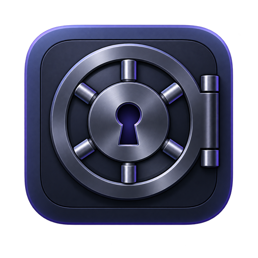

<div align="center">



# Vault

### Private by design. Offline by default.

Secure local vault for API keys, passwords, tokens, SSH keys, notes, JSON, `.env` files, and any other sensitive text.

[](https://github.com/codeverta/vault.codeverta.com/actions/workflows/ci.yml)
[](https://tauri.app/)
[](https://www.rust-lang.org/)
[](#security)
[](LICENSE)

</div>

Vault is a desktop-first, zero-cloud secret manager. Your data is encrypted locally before it is written to SQLite, and the master password is never stored. There is no account, telemetry, sync service, or network dependency.

## Highlights

- Store API keys, secret keys, access tokens, passwords, SSH private keys, recovery codes, license keys, environment variables, secure notes, plain text, JSON, and `.env` configuration.
- Search, filter, tag, favorite, copy, reveal, edit, and delete entries from a focused desktop interface.
- Export the entire vault to a password-protected `.vault` backup and import it on another device.
- Auto-locks after five minutes of inactivity and clears copied secrets from the clipboard after 30 seconds.
- Cross-platform Tauri shell with a Rust security boundary and a React + TypeScript UI.

## Security

Vault uses application-layer encryption so the SQLite database contains encrypted payloads rather than readable secrets:

| Layer | Implementation |
| --- | --- |
| Key derivation | Argon2id, 64 MiB memory, 3 iterations, 16-byte random salt |
| Item encryption | AES-256-GCM with a fresh 12-byte nonce per item |
| Key lifetime | Master key is held only in memory while the vault is unlocked |
| Database | Local SQLite with WAL and synchronous writes enabled |
| Export | Separate AES-256-GCM backup key derived from an export password |
| Network | CSP and application design keep the vault offline |

> Security note: Vault is designed for local use. Keep your master password and backup password safe; they cannot be recovered by the application.

## Getting started

### Prerequisites

- Node.js 20 or newer
- Rust stable and Cargo
- Tauri prerequisites for your operating system ([official guide](https://v2.tauri.app/start/prerequisites/))

### Development

```bash
git clone https://github.com/codeverta/vault.codeverta.com.git
cd vault
npm install
npm run tauri dev
```

On first launch, create a master password with at least 10 characters. The vault database is created in the operating system's application-data directory.

## Installation

### Build a production app

```bash
npm run tauri build
```

Bundled installers are written to `src-tauri/target/release/bundle/`. On macOS Apple Silicon, this produces `Vault_0.1.0_aarch64.dmg` and `Vault.app`.

### Frontend-only checks

```bash
npm run check     # TypeScript
npm run build     # Vite production bundle
```

### Rust checks and tests

```bash
cargo check --manifest-path src-tauri/Cargo.toml
cargo test --manifest-path src-tauri/Cargo.toml
cargo clippy --manifest-path src-tauri/Cargo.toml --all-targets -- -D warnings
```

## Backup and migration

1. Open **Settings → Export & import**.
2. Choose a dedicated backup password and export a `.vault` file.
3. Copy the file to the new device through your preferred secure channel.
4. Create or unlock Vault on the new device, then import the backup with its backup password.

The backup password is separate from the master password. Vault never uploads or syncs this file.

## Project structure

```text
src/                 React + TypeScript interface
src-tauri/src/       Rust commands, encryption, and SQLite storage
src-tauri/icons/     Application icon assets
.github/workflows/   Continuous integration checks
```

## Contributing

Bug reports and pull requests are welcome. Please read [CONTRIBUTING.md](CONTRIBUTING.md) before opening a change. Never include real credentials, tokens, private keys, or `.vault` backups in an issue or pull request.

For security issues, please follow [SECURITY.md](SECURITY.md) rather than opening a public issue.

## License

Vault is released under the [MIT License](LICENSE).

<br />
<div align="center">
  <sub>Built with care for people who prefer their secrets to stay on their own devices.</sub><br />
  <sub>◆ Codeverta · Vault · 2026 ◆</sub>
</div>
# vault.codeverta.com
